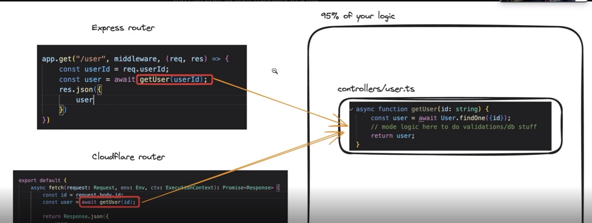

# Create a serverless cloudeflare function

```
npx create cloudflare -- appname

```

# login

```
npx wrangler login
```
# Check login and access...

```
npx wrangler whoami

```

Cloudeflare is similar to the node if we create a api or backend logic onl using node notive http server.
Check it out in the vanniilanode.ts for the native node implementation.....

If we need to convert your nodejs app to work in the cloudeflare.
We have MVC - where the controller we write the logic in seprate the database call - 90% work.
Having controller sepratiely really be Game changer  



### hono - routing engine to write a code with cloudeflae workers

Instead of express we can write hono for easier syntax.
